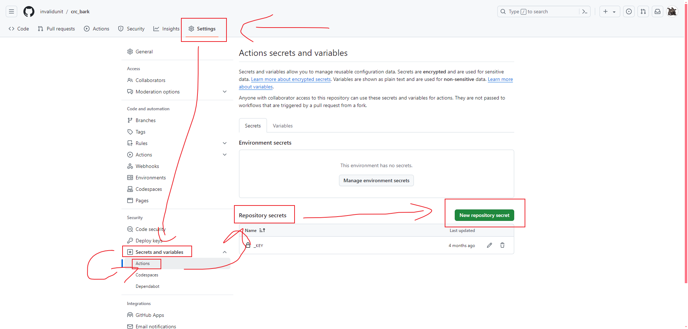

# Check repo change

## 这是啥？

自用的专门用于跟踪越狱 apt 源更新的脚本，基于 shell，运行在 Github Action 上，使用
[Bark](https://apps.apple.com/app/id1403753865 "Bark")
来推送到你的 iPhone

## 他啥时候会运行？

正常应该每个小时的 xx:10 和 xx:40 会被启动，然后加上 Github Action 的延时差不多是 xx:20 和 xx:50 会运行一次，反正最终就是半小时运行一次

如果你想手动激活也可以，在你的储存库中转到 Actions 选项卡，找到 crc，点开，然后右侧点击 Run workflow，然后再次点击 Run workflow

## 什么？你也想用？

#### 关于配置

分叉此储存库，然后修改配置文件，添加你的 bark key

- 1 - 分叉储存库

找到下面这个图标，并点击

名称默认或你随意更改，然后滚到底部点击 Create fork

- 2 - 为 Github Action 启用写入储存库权限

转到你分叉项目的 “Settings” （设置）选项卡，找到 Actions，点开，并打开子项目 General

拉到最下面，找到 “Workflow permissions”（工作流权限），修改为 “Read and write permissions”（读写权限）

然后点击 “Save”

- 3 - 为你分叉的储存库写入 Bark key 

转到你分叉储存库的 “Settings” （设置）选项卡，找到 Secrets and variables，点开，并打开子项目 Actions

拉到最下面 “Repository secrets”（存储库机密），点击右侧的 “New repository secret”（新的存储库机密）

在 Name 中填入 \_KEY

在 Secret 中填入 -k \[你的 bark_key\]，像下面这样

	-k 1111111111111111

如果有多个设备想要推送，那么 Secret 中应该类似下面这样

	-k 1111111111111111 -k 2222222222222222 -k 3333333333333333

- 4 - 修改配置文件

配置文件位于储存库的

	Library/Preferences/com.nan.cac.js

关于如何配置可以模仿我正在使用的配置文件自己改，实在看不懂这里也提供了一个简易的生成器

配置好后全部复制然后替换掉储存库中文件的内容

[简易配置生成器（中文）](https://invalidunit.github.io/crc_bark/create_js_zh.html)

#### 关于测试

删除缓存文件夹

	Library/Caches/

并按照 “他啥时候会运行？” 内手动激活的指南手动激活一次，你的设备应该会收到对应 App 已经成功缓存的通知
